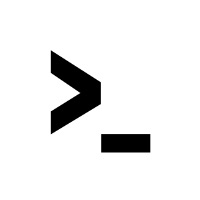
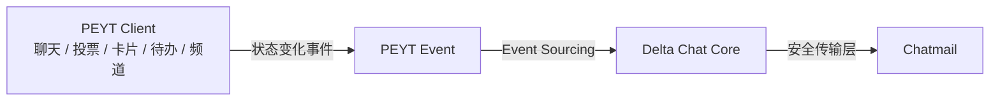
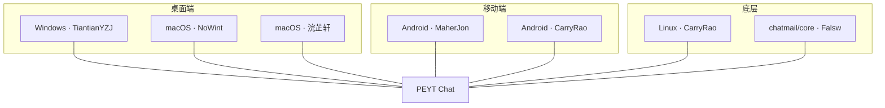

<div align="center">


<br/>



# PEYT Studio

**PleaseEnterYourText Studio** · 请输入文本工作室

`Type Everything`


一个由中学生开发者组成的年轻技术工作室。

</div>

---

## 我们是谁

PEYT Studio 起源于深圳的一场 **AIx脑科学研学活动**。TiantianYZJ、NoWint、SUKY、chenmuyun_bit 四人在 5 天的研学中组队实验、一起完成汇报、彻夜讨论 AI 与技术。活动结束那天，大家不想就此失联——于是把一个研学小组，变成了一个长期技术工作室。

> [!NOTE]
> 我们不是公司，不是商业创业团队，更像一个**年轻开发者技术社团**：因兴趣聚集，因项目合作，因技术成长。成员年龄大约 13–15 岁，自由、开放、兴趣驱动。

## 我们在做什么

### PEYT Chat — 面向开发团队的端到端加密协作聊天

基于 **Delta Chat** 生态深度定制，客户端采用 **Tauri**，覆盖 Windows / macOS / Linux / Android。

- [x] workspace / channel 体系（`spaceType: chat / card`）
- [x] Work 页卡片任务系统：看板 / 列表 / 日历 / 时间线四视图
- [x] Bot 账号系统 + LLM 运行时（DeepSeek / OpenAI / Claude）
- [x] 插件系统（GitHub Pages 市场，`new Function` 直执行 + 权限门控）
- [x] 好友邀请系统（`peyt://` 链接 / SecureJoin 二维码）
- [x] 11 套主题 + 全局字体缩放
- [x] 已对齐 Delta Chat 功能批次 1–4

### 架构



Chatmail 不存储数据，只是**安全传输层**；真正数据存在客户端。我们不发送「整个状态」，只发送「状态变化事件」——数据库只是事件重放的结果。

> 详细技术路线见 [studio/03-project.md](studio/03-project.md) · 架构见 [studio/04-architecture.md](studio/04-architecture.md)

---

## 团队

<div align="center">


</div>

| 成员 | 角色 | 平台方向 |
|---|---|---|
| [TiantianYZJ](members/TiantianYZJ/TiantianYZJ.md) | 联合创始人 | Desktop @ Windows |
| [NoWint](members/NoWint/NoWint.md) | 联合创始人 | Desktop @ macOS、TUI |
| [SUKY](members/SUKY/SUKY.md) | 联合创始人 | — |
| [chenmuyun_bit](members/chenmuyun_bit/chenmuyun_bit.md) | 联合创始人 | — |
| [CarryRao](members/CarryRao/CarryRao.md) | 核心成员 | Android Backend、Desktop Linux |
| [浣芷轩](members/浣芷轩/浣芷轩.md) | 核心成员 | Desktop macOS |
| [Falsw](members/Falsw/Falsw.md) | 核心成员 | — |
| [MaherJon](members/MaherJon/MaherJon.md) | 核心成员 | Android Frontend |



> 规模：计划 10 人左右，当前核心 8 人，长期上限 15 人。
> 成员个人档案见 [members/00-index.md](members/00-index.md) · 团队架构见 [studio/02-team.md](studio/02-team.md)

---

## 项目仓库

| 仓库 | 说明 |
|---|---|
| [PleaseEnterYourTextCommunity](https://github.com/NoWint/PleaseEnterYourTextCommunity) | PEYT Chat 桌面客户端（Tauri v2 + deltachat core） |
| [ChatMail-ANY-Linux-Deploy](https://github.com/TiantianYZJ/ChatMail-ANY-Linux-Deploy) | 自部署 Chatmail 服务（任意 Linux，Docker 部署方案） |
| [About](https://github.com/PleaseEnterYourText-Studio/About) | 本仓库 · 工作室官方档案 |

---

## 开源与自主可控

> [!IMPORTANT]
> 我们为什么自研 PEYT Chat？因为 Delta Chat 需翻墙、依赖海外服务器。端到端加密 + **自主可控 + 可自部署**，是这件事的内核动机，也是对外叙事的主轴。

PEYT Chat 保持**开放源码**，但不主动大规模宣传——P2P、去中心化、E2EE 在国内环境下推广有现实限制。有技术能力的人，可以自行部署。

---

## 加入我们

> [!TIP]
> 我们正在招人，面向 **14–18 岁**、有热情有基础的年轻开发者。

- **关注**：LLM / AGI / AIGC / Agent / Harness
- **需要**：编程热情 · 开发能力 · Git 协作经验 · AI 兴趣
- **不喜欢**：混名额 · 不写代码 · 只会给 AI 下指令 · 不懂工程 · 不协作

<details>
<summary><b>完整档案目录</b></summary>

```
PEYT Studio/
├── README.md                  # 本页面（About）
├── studio/                    # 工作室总档
│   ├── 01-about.md            # 基本信息 / 成立背景 / 定位 / 文化 / 理念
│   ├── 02-team.md             # 团队架构 / 分工总览
│   ├── 03-project.md          # 项目 PEYT Chat 定位 / 路线 / 开发状态
│   ├── 04-architecture.md     # 通信架构 / Event 模型 / Event Sourcing
│   └── 05-ops.md              # 代码仓库 / 开源态度 / 招募 / ChatMail 部署
├── members/                   # 成员档案（每人一个文件夹：档案 + 头像）
│   └── 00-index.md
└── archive/                   # 群聊记录总结与归档

</details>

---

<div align="center">

**PEYT Studio** — Type Everything

</div>
